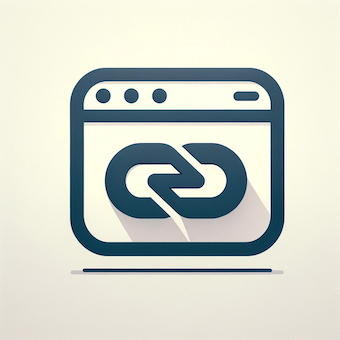

## Logseq URL Title Tagger

The Logseq URL Title Tagger automatically fetches website titles, formats them into markdown links, and displays the favicon next to it.


To disable the favicon and the loading indicator, override the variables.
- Open the Logseq desktop app and go to the setting page.
- Find the `Custom theme` option and click the `Edit custom.css` button.
- And you can add custom css like below.

```css
:root {
  --favicons: none;
  --indicator: none;
}
```

## Issues?

If you found any bugs or got any feature request please open an issue on this repository.

## Credits

Forked from https://github.com/0x7b1/logseq-plugin-automatic-url-title

## License

[MIT License](./LICENSE)
