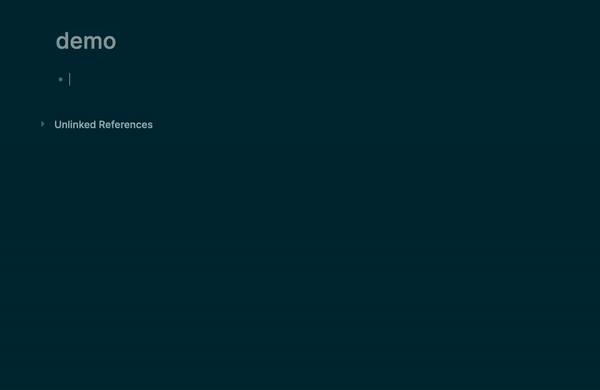

## Logseq URL Title

Automatically fetches the title of a website and wraps it into markdown link format. Also, renders the favicon of the url next to it.



To disable the favicon, override the `--favicons` variable.

```css
:root {
  --favicons: none;
}
```

## Credits

Forked from https://github.com/0x7b1/logseq-plugin-automatic-url-title

## License

[MIT License](./LICENSE)
